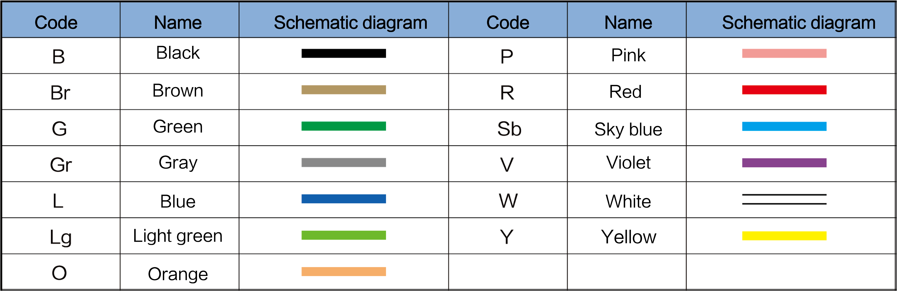
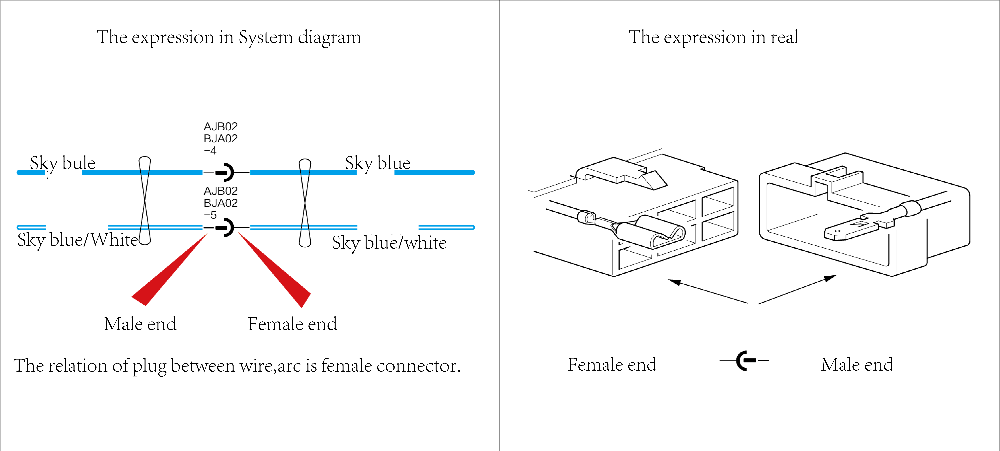

# Drawing Description
## Instructions for use of system circuit diagrams

## [A] Power system identification
When supplying power to the fuse, it indicates the position of the ignition key. The line code "30" is a live line, which is generally provided by the front compartment electrical box or the instrument panel electrical box. For details, see the power circuit diagram. IG1, IG3 and IG4 are the live wires when the start switch is in the ON or START position. See the power circuit diagram for details;

## [B] Fuse
Indicate the name and current magnitude of the fuse;
* The fuses of front compartment distribution box are numbered as F1/X according to the corresponding position, F means the fuse code, 1 means the installation position is in front compartment distribution box, X means the serial number, such as F1/03: Fuse 3 installed in front compartment distribution box.
* The fuses of instrument distribution box are numbered as F2/X according to the corresponding position, F means the fuse code, 2 means the installation position in instrument distribution box, X means the serial number, such as F2/03: Fuse 3 installed in instrument distribution box.
 
> ## Caution
> 
> * If fuses are burned, eliminate the fault before replacing them with new ones;
> * Use fuses specified by the manufacturer. Never use any fuse that exceeds the manufacturer's specified current rating;
> * Never insert fuses partially. Insert them into the holder in place.

## [C] Wire color and wire diameter
*  Wire color: indicates the color of the wire, and the color is represented by the letter code; The wire is divided into single-color and multi-color wire, as shown in the figure below.
  

See the following table for wire color and code:

*  Wire diameter: 0.5 means the cross-sectional area of the wire is 0.5 mm²

## [D] Relay
* The relays of front compartment distribution box are numbered K1-X according to the corresponding position, K1 indicates the relay code of front compartment distribution box, X means the serial number of the relay installed in the X position of front compartment distribution box, such as K1-1, K1 -2……;
* The relays of instrument distribution box are numbered K2-X according to the corresponding position, K2 indicates the relay code of instrument distribution box, X means the serial number of the relay installed in the X position of instrument distribution box, such as K2-1, K2-2……

> ## Caution
> 
> If the relay has no code, the relay is inside the distribution box.

## [E] Hinge point
It represents that two or more wires are hinged together on the wire, and the hinge point is the code.

## [F] Female&male connector
* It indicates the connector between the wiring harnesses. For example, BJA02 AJB02-4 indicates that the front compartment wiring harness is connected to the engine wiring harness, where BJA02 is the female connector and AJB02 is the male connector; - 4 represents pin 4 of the female&male plug, as shown in the following figure:

## [G] Symbol of component
For schematic diagram of the internal part of a component, see circuit diagram symbol description for details.

## [H] Terminal code and pin
* Connector code: The connector code connected to components, such as B14-3, B14 indicate that B is the wiring harness with the connector, and 14 indicates the sequence number of the wiring harness connectors; There are multiple coded connectors connected to the component or various types of connectors with different specifications or equipment, can be differentiated by encoding, such as: the connector codes on the left body control module are BG64(B), BG64(C), KG64(E), etc.;
* The wiring harness code is shown in the table below:

## [I] Distribution box
* This vehicle is equipped with two distribution boxes, the front compartment distribution box and instrument panel distribution box. See the distribution box information and related circuit diagrams for details.

## [J] Connector definition
* Used to illustrate the function or description of the terminal.

## [K] Go to the next end
* Indicates that the wire is connected to the parts, or you can check the circuit diagram related to this part for related information.

## [L] Ground point
* Eb09: E represents the ground point code, b represents the wiring harness of the ground point, the code is the lowercase letter code of the wiring harness, and 09 is the sequence number of the grounding point of the wiring harness;

## [M] Go to another system circuit diagram
* For this section, go to another system circuit diagram where you can check the more details in the system circuit diagram.

## [N] Twisted pair
* Definition: Refers to two mutually insulated and wound wire in accordance with a certain specification and made of a general wiring;
* Function: prevent external electromagnetic interference and reduce external interference of its own signal.
* Indication method:

## [O] Shielded wire
* The shielded wire is a transmission line that uses a metal mesh braid to wrap the signal line; The shielding layer of the shielded wire needs to be grounded, and external interference signals can be introduced into the grounding position.
