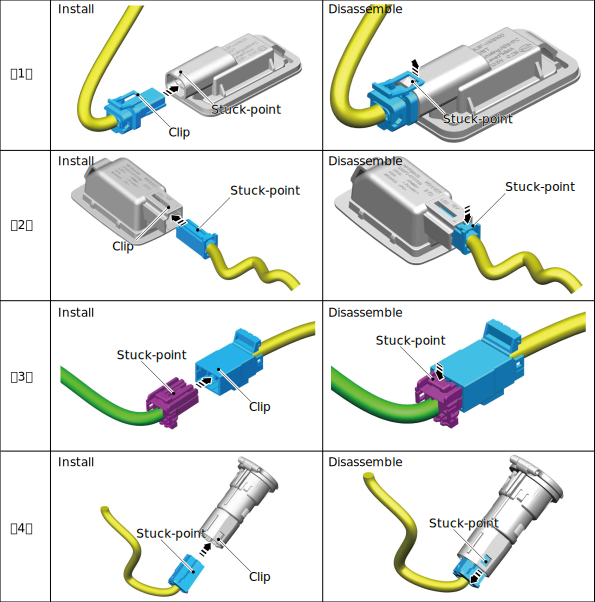
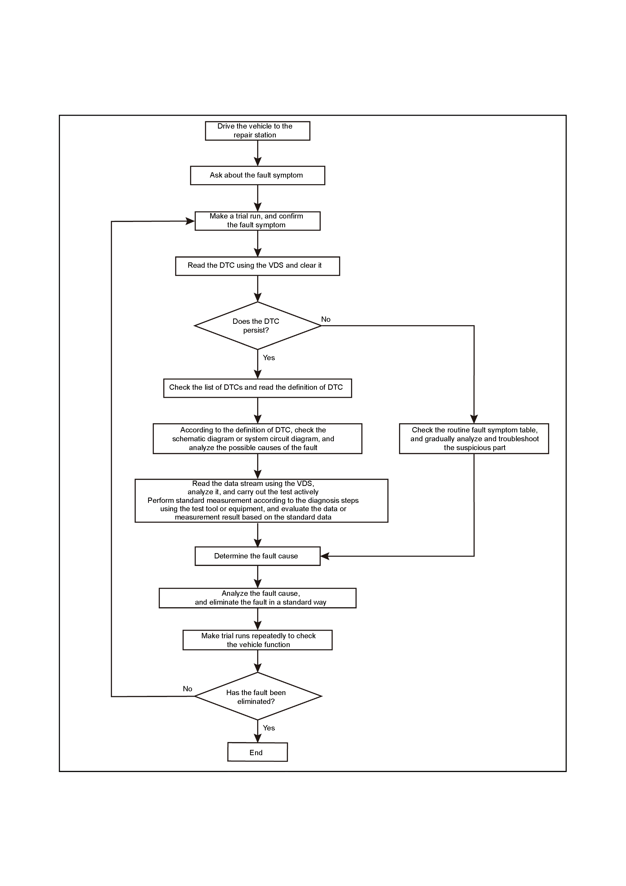

# Common Connector Clamping Structures
## General clamping structure

* As shown in the figure, the following connectors are the most common type of clamping, where the male and female sheaths are locked by stuck-points and clips. Align them first, connect them slowly, and then connect them in place, indicated by a "click” sound (If there is no “click” sound, press the stuck-point to make the stuck-point release from the clip, and then pull out the connector).

## Connector with hold lock
* As shown in the figure, the following connector has a hold lock. Pull it out before connecting, push it in to the locked position. otherwise, remove the hold lock and then pull out the connector.

