# Back door harness

## Eb01
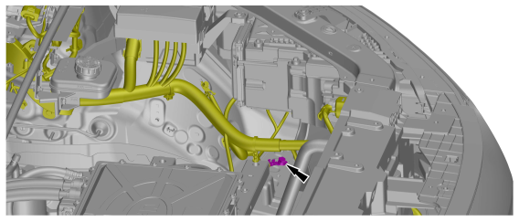

## Eb02
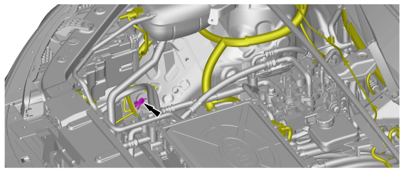

## Eb03
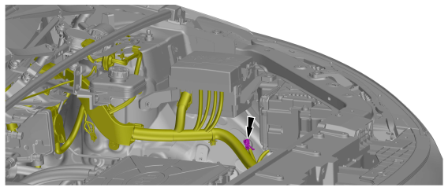

## Eb04
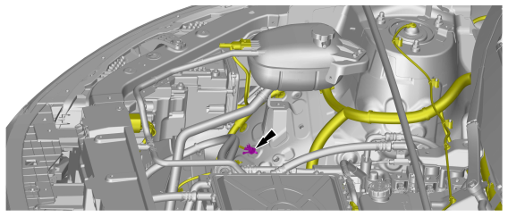

## Eb05
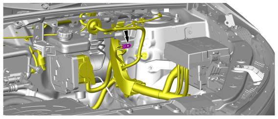

## Eb06
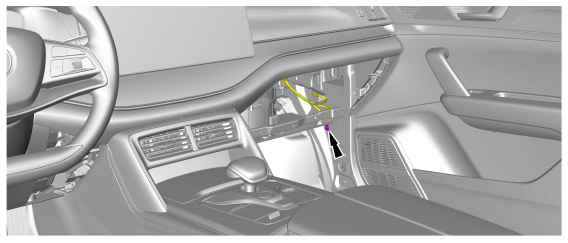

## Eb07
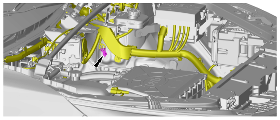

## Eg01
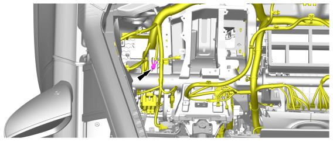

## Eg02

## Eg03
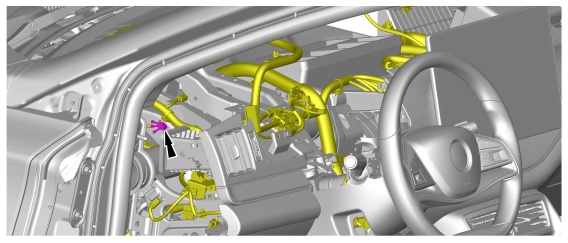

## Eg05
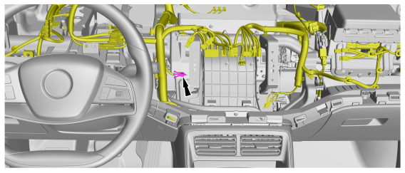

## Eg09
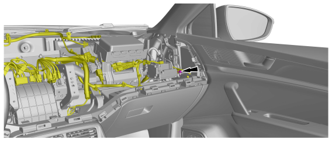

## Ek01
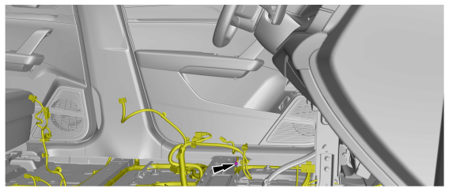

## Ek02
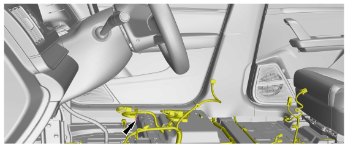

## Ek03
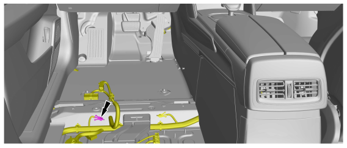

## Ek04
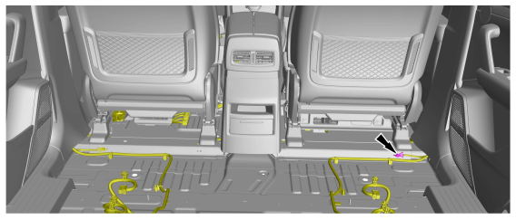

## Ek05
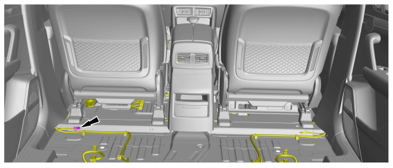

## Ek06
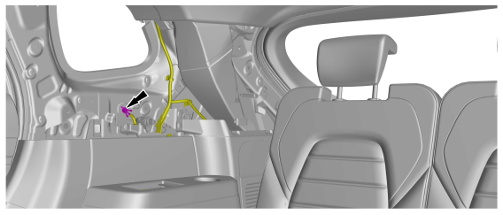

## Ek07
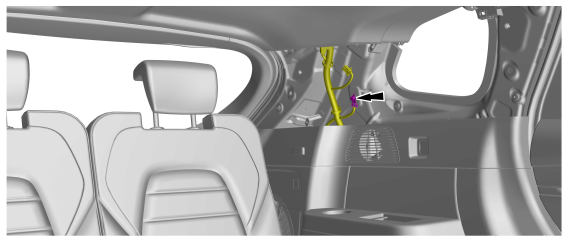

## Ek08
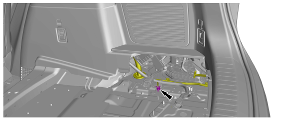

## Ek09
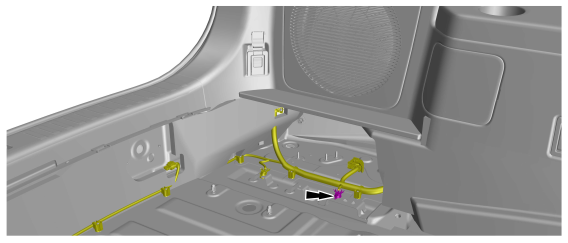

## Ek10
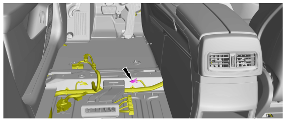

## Ek11
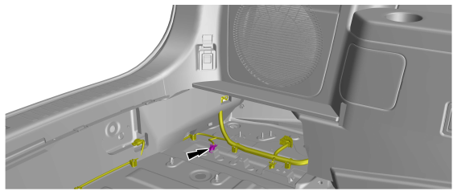

## Ek12
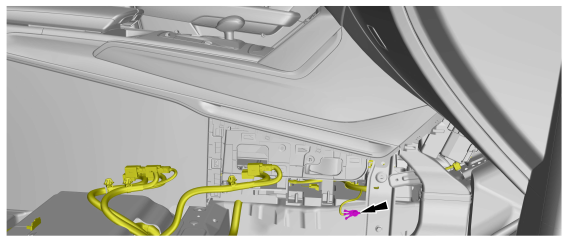

## Ep01
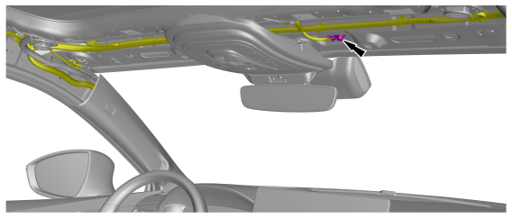

## Ey01
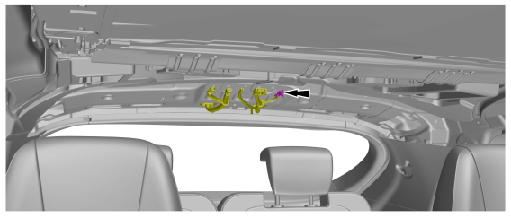

## Ey01
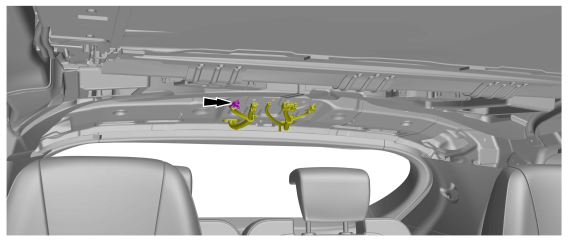