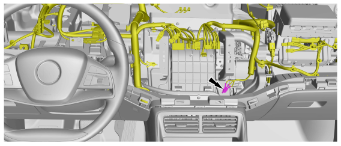

# Back door harness

## Eb01

## Eb02

## Eb03

## Eb04

## Eb05

## Eb06

## Eb07

## Eg01

## Eg02

## Eg03

## Eg05

## Eg09

## Ek01

## Ek02

## Ek03

## Ek04

## Ek05

## Ek06

## Ek07

## Ek08

## Ek09

## Ek10

## Ek11

## Ek12

## Ep01

## Ey01

## Ey01
