# Docking Connector

## BJD01 & DJB01
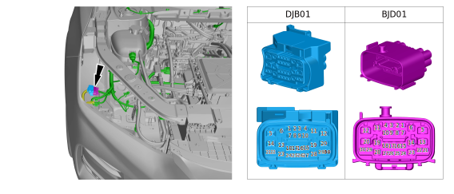

## BJD02 & DJB02
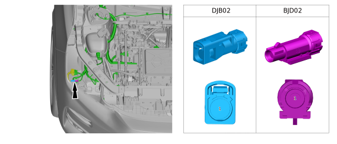

## BJG01 & GJB01
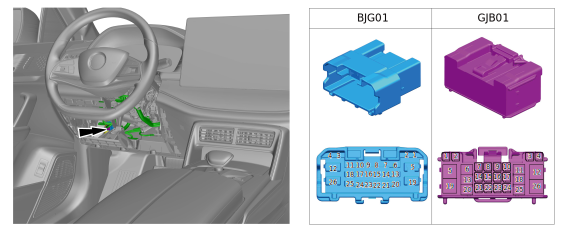

## BJG03 & GJB03
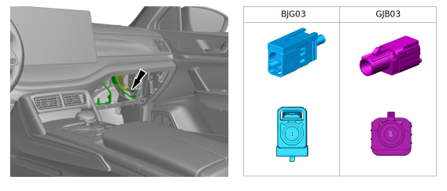

## BJK01 & KJB01
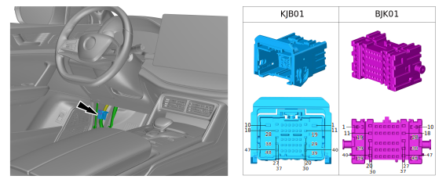

## BJK03 & KJB03
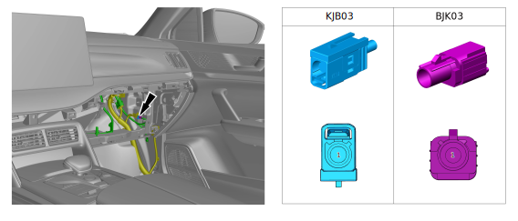

## GJGa01 & GaJG01
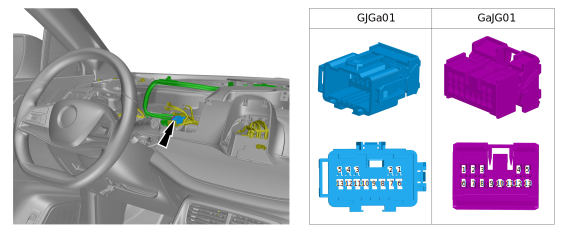

## GJGa03 & GaJG03
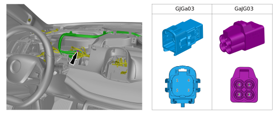

## GJGa04 & GaJG04
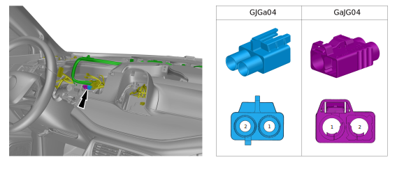

## GJK01 & KJG01
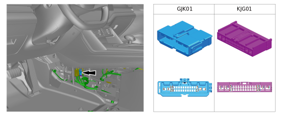

## GJK02 & KJG02
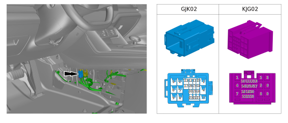

## GJP01 & PJG01
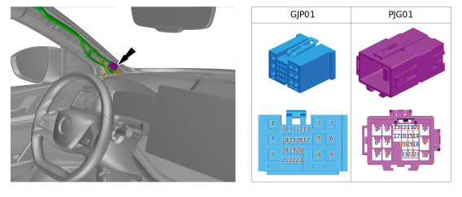

## KaJK01 & KJKa01
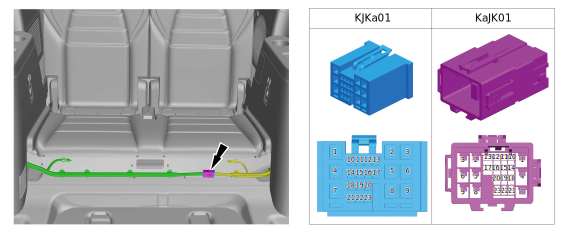

## KJB02 & BJK02
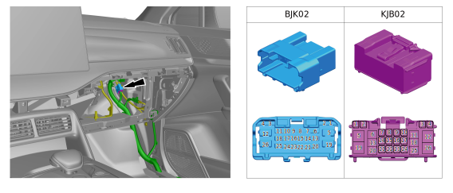

## KJG03 & GJK03
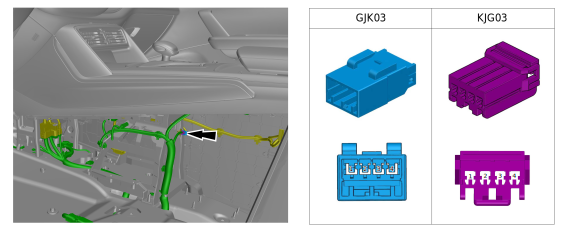

## KJG04 & GJK04
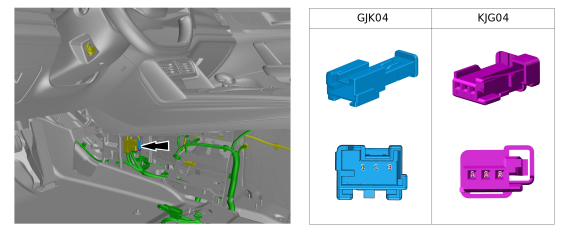

## KJR01 & RJK01
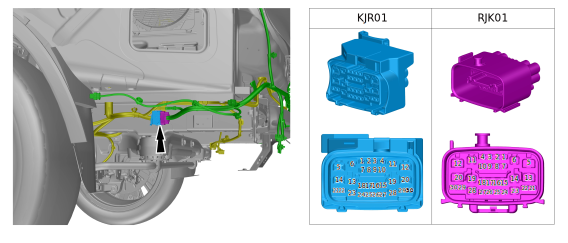

## KJR04 & RJK04
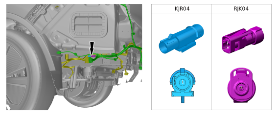

## KJT01 & TJK01
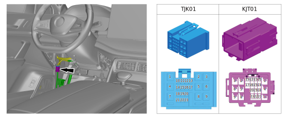

## KJT02 & TJK02
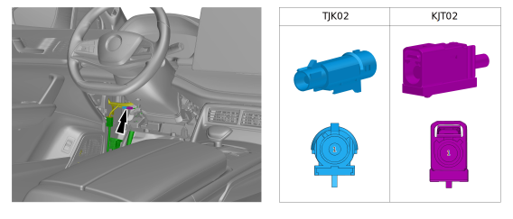

## KJV01 & VJK01
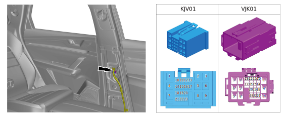

## KJW01 & WJK01
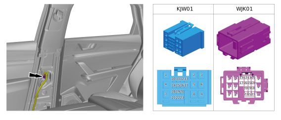

## KJY01 & YJK01
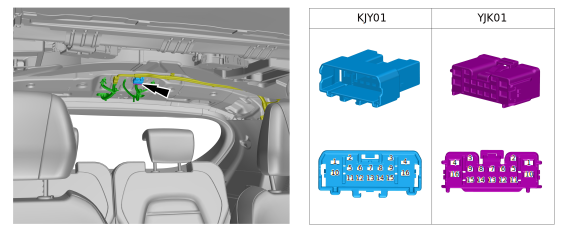

## KJY02 & YJK02
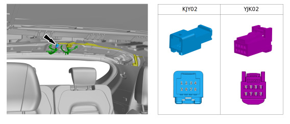

## KJZc01 & ZcJK01
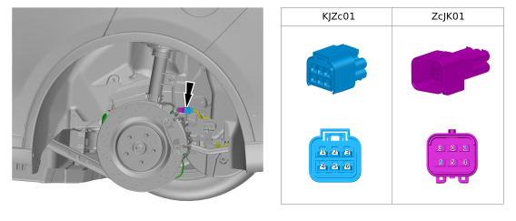

## KJZd01 & ZdJK01
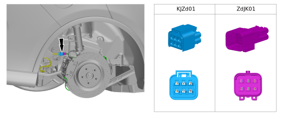