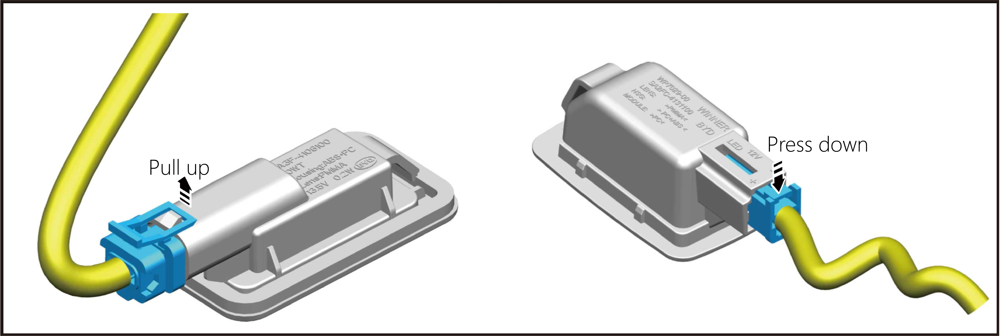
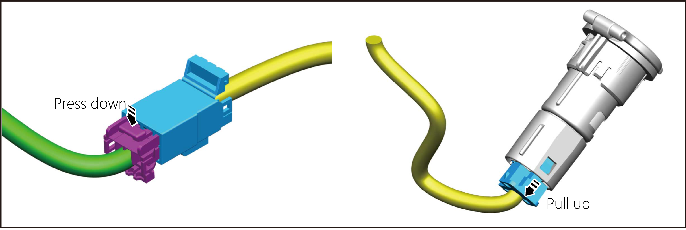
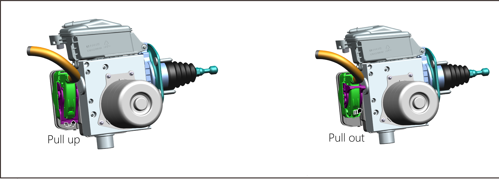

# Common Connector Disconnection Method

The types of wiring harness connectors Commonly used in automobiles are buckle locks, slide locks and rod locks. The following describes the removal and Installation methods of these three wire wiring harness connectors.

1. **Buckle Lock Type Connector:** The locking connector of buckle lock prevents accidental release or disconnection of the connector, and the locking connector can be disconnected by pressing or lifting the locking tab, as shown in the figure.

> ## Caution
> When disconnecting the plug, do not pull on the harness or wiring to prevent damage to the parts.

2. **Slide Lock Type Connector:** The latch fitting prevents incomplete latching, accidental loosening or disconnection. Some systems and components (especially related to OBD) use slide lock connector. The slide lock connector can be disconnected by pressing or pulling the slider,, as shown in the figure.

> ## Caution
> When disconnecting the connector, do not pull on the harness or wiring to prevent damage to the parts, and do not damage the connector bracket to prevent damage to the parts.

3. **Rod Lock Type Connector:** Rod lock wiring harness connectors are used on some control units and control modules, super multiplexer connectors, etc. When connecting, the rod must be fully locked in place by moving the rod to the lock position to ensure that the connection is complete, as shown in the figure.

> ## Caution
> Before disconnecting or connecting these connectors, always verify that the buckle is fully released (loosen) to avoid damage to the connector housing or terminals
